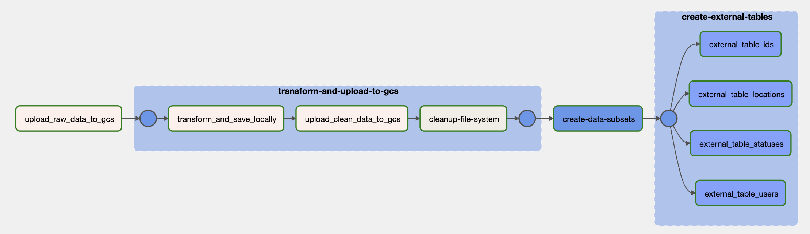
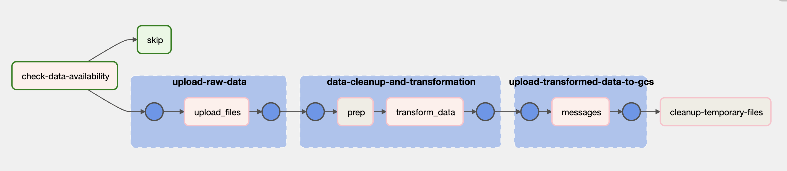

# Data Ingestion & Transformation with Airflow and Spark

Within the [`airflow`](.) repository there are [`assets`](./assets/),[`scripts`](./scripts/), [`dags`](./dags/) ,[`logs`](./logs/) folders.

The `assets` directorty is the common file system that Airlfow scheduler and TaskInstances can reach therefore
this repository used for storing initial raw data (as local data) and temprorary intermediate files during the cleaning and transformations steps.

The `dags` directory contains all dag definitions and configuration file which is used to centeralize required setup parameters and schemas over cross-dags. Two data pipelines are created in that folder to ingest local data to gcs bucket.

1 User-Data pipeline




2 Message-Data pipeline: generic enough solution that allow us to ingest message-data coming from any channel




3 DWH pipeline: responsible to create BigQuery tables for collected message-data

In Data Ingestion step, all capability of Airflow is used to improve readability and re-usability of pipelines.
Threfore, related tasks are grouped in TaskGroup and undependent tasks are handled in parrallel.

For further information and source code please check the [`airflow/dags`](./dags/) in the project.

----
## Running Airflow Locally

### Prerequsites

 - GCS bucket has to be exist to move on that step. (Please follow steps described in [Infrastructure as Code](../iac/README.md) if you are not sure.)
 - The data (users.json and course-data-engineering) should be available in [airflow/assets/slack-data](./assets/slack-data/). If you are not sure about where to find the dataset, please ask me as the dataset is not pushed in source control to avoid sharing any personal information of slack users.


1. Navigate to airflow directory
```shell
cd airflow
```
2. Build the docker image
```shell
docker build -t airflow-compact:v01 .
```
3. Setup .env
Please update the following parameters based on your project and environment setup correctly to be able to run airflow smoothly.
```shell
GCP_PROJECT_ID=<...>
GCP_GCS_BUCKET=<...>
BIGQUERY_DATASET=<...>
GOOGLE_APPLICATION_CREDENTIALS=<...>
_PIP_ADDITIONAL_REQUIREMENTS=<...>
```
4. Create Docker Containers
```shell
docker compose up
```
