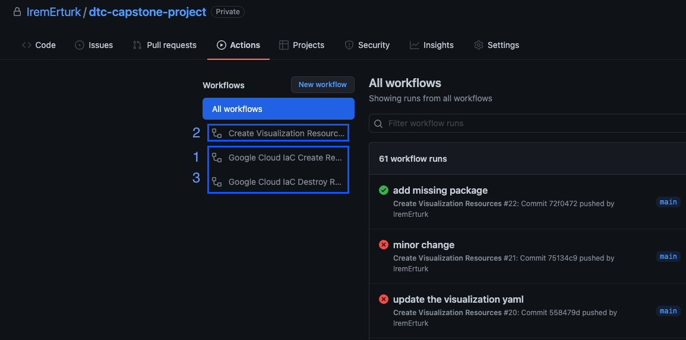

# CICD with GitHub Actions

To see these actions, in the project level the Github Actions should be enabled in GitHub. 
You can find detailed documentation regarding that in official GitHub [documentation](https://docs.github.com/en/repositories/managing-your-repositorys-settings-and-features/enabling-features-for-your-repository/managing-github-actions-settings-for-a-repository#about-github-actions-permissions-for-your-repository).

In project three are three workflows defined for automated execution of tasks.
1. [GC IaC Create Resources](../.github/workflows/infrastructure-apply.yaml)
2. [Create Visualization Resources](../.github/workflows/visualization.yaml)
3. [GC IaC Destroy Resources](../.github/workflows/infrastructure-destroy.yaml)

The first and second workflow will be automatically triggered respectively when there is change in [iac](../iac/) and [visualization](../visualization/) folders.

The third workflow is only runs with the users manual input from GitHub UI. 
